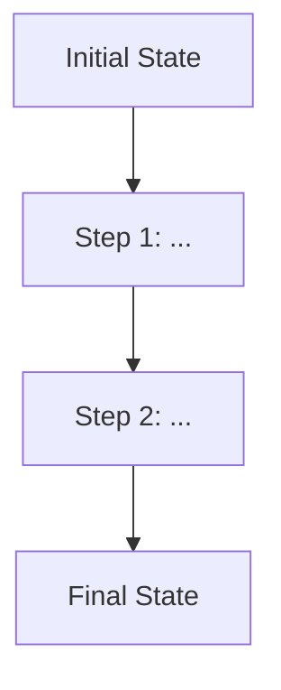

# Template E: The Algorithmist

> Use this template for **Algorithms and Data Structures** -- sorting, searching,
> graph traversal, dynamic programming, tree operations, LeetCode-style problems,
> or any prompt asking about algorithmic strategy, complexity, or implementation.

---

## Header Block (Always include first)

```
> **Seed:** "[Paste the original {{...}} prompt text here verbatim]"
> **Lens:** The Optimizationist
```

---

## Section Structure

### 1. The Core Intuition

Before any formalism, explain the algorithm's **strategy in one sentence** using a real-world analogy:
- "Binary Search is like looking up a word in a physical dictionary -- you open to the middle, decide if the word is before or after, and halve the remaining pages."
- "Dijkstra's is like a growing puddle of water on a tiled floor -- it always expands to the nearest dry tile first."

Then state the **problem it solves** precisely: input format, output format, constraints.

### 2. The Logic (Visual Trace)

Provide a **step-by-step trace** on a small, concrete example (5-8 elements):
- Show the state of the data structure at each step.
- Use a table, numbered list, or Mermaid diagram.



OR use a state table:

| Step | Action | Data State | Notes |
| :--- | :--- | :--- | :--- |
| 0 | Initial | [5, 3, 8, 1, 4] | Unsorted |
| 1 | Compare | ... | ... |

The trace is **mandatory**. Abstract descriptions without concrete examples are insufficient.

### 3. Complexity Analysis

For each bound, explain **why**, not just what:

- **Time:**
  - Best case: O(?) -- under what conditions?
  - Average case: O(?) -- what distribution is assumed?
  - Worst case: O(?) -- what input triggers this?

- **Space:**
  - O(?) -- auxiliary space only (excluding input).
  - Is it in-place? Does it require recursion stack space?

- **Key insight:** What mathematical property makes this complexity achievable? (e.g., "Each element is visited at most twice due to the two-pointer invariant.")

### 4. Implementation (Optimized)

Provide a clean, commented implementation in the most natural language for the algorithm. Prefer Python for general algorithms, C++ for systems-level algorithms:

```python
def algorithm_name(input):
    """
    Brief docstring stating what this does.
    Time: O(?)  Space: O(?)
    """
    # Step 1: ...
    # Step 2: ...
    return result
```

**Requirements:**
- Include a docstring with complexity.
- Comment each logical block (not every line).
- Handle edge cases explicitly (empty input, single element, duplicates).

### 5. Edge Cases & Gotchas

List **at least 3** edge cases and how the algorithm handles each:

| Edge Case | Input Example | Expected Behavior | Common Bug |
| :--- | :--- | :--- | :--- |
| Empty input | `[]` | Return immediately | IndexError |
| Single element | `[1]` | Already sorted/found | Off-by-one |
| All duplicates | `[3,3,3]` | Handle correctly | Infinite loop |

### 6. Variants & Related

Name 1-2 related algorithms or variants:
- How does this algorithm relate to similar ones? (e.g., "Merge Sort is the stable variant of Quick Sort's divide-and-conquer approach.")
- When would you pick the variant instead?

---

## Output Rules

- **Depth:** Scale with the algorithm's complexity. A basic search takes 250 words; a graph algorithm with multiple variants may need 800+. The visual trace must be thorough regardless of length.
- **Tone:** Precise and pedagogical. Teach through examples, not definitions.
- **Formatting:** The visual trace and edge case table are mandatory.
