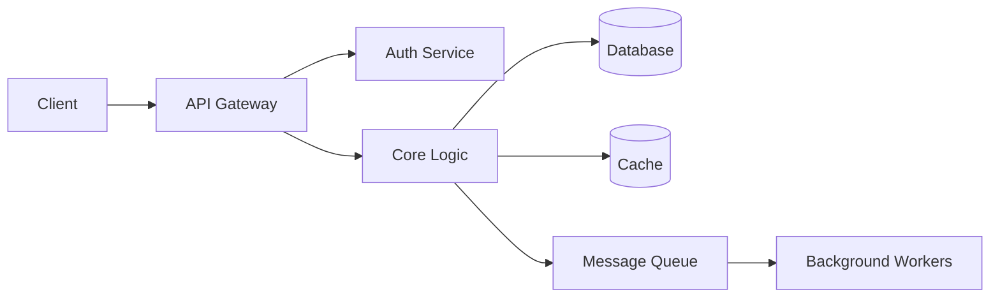

# Template G: The Blueprint

> Use this template for **System Design & Architecture** -- when the prompt asks
> about designing a system, understanding an architectural pattern (MVC, event-driven,
> microservices), or planning the structure of a codebase, API, database schema,
> or distributed system.

---

## Header Block (Always include first)

```
> **Seed:** "[Paste the original {{...}} prompt text here verbatim]"
> **Lens:** The Architect / Modularity
```

---

## Section Structure

### 1. Requirements Analysis

Before designing, state what the system must do:
- **Functional requirements:** The core features (3-5 bullet points).
- **Non-functional requirements:** Performance targets, scalability needs, availability SLA, security constraints.
- **Assumptions:** Explicitly state what you're assuming about scale, users, and environment.

### 2. High-Level Architecture

Provide a **component diagram** showing the major building blocks and how they communicate:



Name each component and state its responsibility in one sentence.

### 3. Data Model

Define the core **entities and relationships**:
- Use a table or ER diagram.
- Name the primary keys, foreign keys, and critical indexes.
- State the storage engine choice and why (SQL vs NoSQL, row vs columnar).

| Entity | Key Fields | Storage | Rationale |
| :--- | :--- | :--- | :--- |
| User | id, email, role | PostgreSQL | Relational; ACID for auth |
| Event | id, timestamp, payload | MongoDB | Schema-flexible; write-heavy |

### 4. Key Design Decisions

For each major trade-off, state:
- **Decision:** What you chose.
- **Alternative:** What you rejected.
- **Rationale:** Why, with concrete reasoning (not "it's better").

**Real-world analogy:** Frame the overall architecture using a physical-world parallel. Example: "This system is like a restaurant: the API gateway is the host (routes customers), the services are kitchen stations (each handles one dish type), and the message queue is the ticket rail (decouples orders from cooking)."

### 5. Failure Modes & Scaling

- **Single points of failure:** What happens if each component dies?
- **Horizontal scaling:** Which components scale out, and how?
- **Bottleneck prediction:** What breaks first at 10x, 100x, 1000x load?

---

## Output Rules

- **Depth:** Scale with the system's scope. A single-service design may need 300 words; a distributed system with multiple components may need 1000+. Every component must be justified.
- **Tone:** CTO-level clarity. Every component earns its existence.
- **Formatting:** Architecture diagram (Mermaid) is mandatory.
