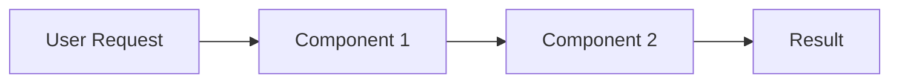

# Template I: The Case Study

> Use this template for **Real-World Product/Technology Case Studies** -- when the
> prompt asks about how a specific company, product, or technology solved a
> particular problem. Examples: "How does Google's MapReduce work?", "How does
> Discord handle millions of concurrent users?", "How did Spotify build Discover
> Weekly?", "Why did Hertz's legacy system fail?"

---

## Header Block (Always include first)

```
> **Seed:** "[Paste the original {{...}} prompt text here verbatim]"
> **Lens:** Systems Thinking / Chesterton's Fence
```

---

## Section Structure

### 1. The Problem Statement

What problem did they face? State it precisely:
- **Scale:** How big was the challenge? (users, data volume, transactions/sec)
- **Constraint:** What made it hard? (latency, cost, legacy, regulation)
- **Stakes:** What happened if they failed? (revenue loss, safety risk, competitive death)

### 2. The Solution Architecture

Describe **what they actually built**, not what a textbook says:
- Name the specific technologies, protocols, or patterns used.
- Show how the components interact (use a diagram if possible).
- Highlight what's **novel or unconventional** about their approach.



### 3. The Key Insight

Identify the **one non-obvious decision** that made everything work:
- Why did they choose this approach over the "textbook" solution?
- What constraint or insight led to this design?
- How does this differ from what a naive implementation would look like?

**Real-world analogy:** Frame the insight using everyday reasoning. Example: "Netflix's Chaos Monkey is like a fire drill -- you break things on purpose during calm moments so you're prepared for real disasters."

### 4. Trade-Offs & Limitations

What did they **give up** to get what they got?
- Consistency sacrificed for availability? (CAP theorem)
- Latency sacrificed for accuracy?
- Engineering complexity added for operational simplicity?
- Technical debt accepted for time-to-market?

### 5. Lessons for Your Own Systems

Extract **2-3 transferable principles** that apply beyond this specific case:
- "Lesson: Batch processing at scale often beats real-time when latency requirements allow a delay."
- "Lesson: Designing for failure (assuming things WILL crash) produces more resilient systems than designing to prevent failure."

These should be actionable -- things the reader can apply to their own projects.

---

## Output Rules

- **Depth:** Scale with the case's complexity. A single clever optimization may need 300 words; a full system redesign (e.g., Netflix's microservice migration) may need 1000+. The "Key Insight" section must always be substantive.
- **Tone:** Engineering post-mortem style. Respect the problem's difficulty.
- **Formatting:** Architecture diagram preferred. The "Key Insight" section is the most important -- don't bury it.
