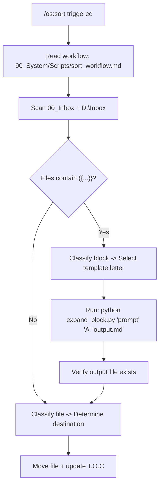
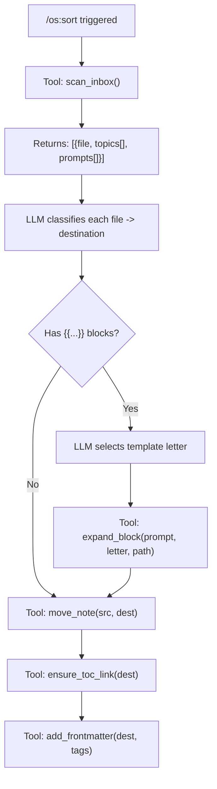
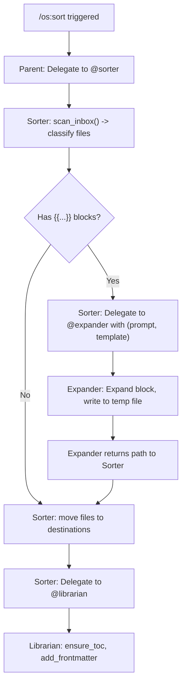
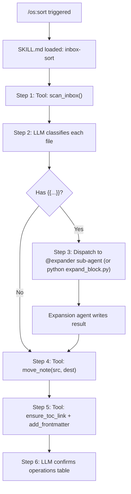

---
tags:
  - "#type/report"
  - "#field/cs"
  - "#subject/systems"
  - "#concept/architecture"
---
[[T.O.C (90_System)|Up to 90_System]]

# Kybernetes OS v2: Architectural Blueprints

> **Date:** 2026-02-28
> **Phase:** Architecture Review (Pre-Implementation)
> **Input:** [[System_Prompt_Diagnostic_Report]], [[Infrastructure_Diagnostic_Report]], [[Shell_Pipe_Corrected_Analysis]]

---

## The Problem Statement (Unified)

Every Gemini CLI session starts with **~9,500+ tokens** of static overhead:

```
GEMINI.md system prompt:  ~4,600 tokens (60% dead weight)
MCP tool schemas (11 servers): ~4,550 tokens (wisdom-os + filesystem overlap)
Memory files:                    ~100 tokens
─────────────────────────────────────────────
TOTAL STATIC COST:             ~9,250 tokens  (before user types anything)
```

The Inbox Processing Protocol is a 6-step state machine written in English that the LLM executes non-deterministically. The Shell-Pipe Protocol spawns a fully-loaded clone (~9,450 token child) to expand a ~300 token task. The `wisdom-os` MCP server has a broken path, and `filesystem` overlaps with it on 3 of 5 core operations.

**Goal:** Reduce static overhead to **<3,000 tokens**, make Inbox processing deterministic, and eliminate write contention -- while preserving every feature.

---

## Blueprint A: The Slim Kernel (JIT Context Loading)

### Core Philosophy
> *"The system prompt should be a routing table, not an encyclopedia."*

Strip `GEMINI.md` to a minimal **declarative core** (~1,500 tokens). All procedural logic, templates, and persona definitions become external files loaded on-demand via tool calls. The LLM learns *what exists and where to find it*, not *the full content of everything*.

### Architecture

```
GEMINI.md (~1,500 tokens)
├── Section 1: Vault Structure (PARA + T.O.C rules)
├── Section 2: Drive Architecture (partition map)
├── Section 3: Directory Routing Table
├── Section 4: Behavioral Directives (merged personas, 3 sentences)
├── Section 5: Conventions (4 rules)
└── Section 6: Registry (pointers to external files)
    ├── "Templates: 90_System/Templates/Template_{A-F}.md"
    ├── "Workflows: 90_System/Scripts/{sort,boot,expand}.md"
    └── "Mental Models: 90_System/Agents/Gemini/*.md"
```

**Shell-Pipe replacement:** `expand_block.py` (Option B from the Corrected Analysis). Python script handles quoting, template injection, and child spawning deterministically.

### How It Solves the Bloat

| Component | Current | After | Savings |
| :--- | :--- | :--- | :--- |
| GEMINI.md | ~4,600 | ~1,500 | **-3,100** |
| Tool schemas | ~4,550 | ~4,550 | 0 (unchanged) |
| **Total static** | **~9,250** | **~6,150** | **-3,100** |

Templates/workflows are loaded *only when a workflow triggers*. During a normal Q&A or coding session, 0 extra tokens are consumed.

### Inbox Processing Flow



### Arsenal Utilization

| Tool | Role | Weight |
| :--- | :--- | :--- |
| **Custom Tools (Python)** | `expand_block.py` handles shell-pipe safely | **Primary** |
| **Context Files** | Slim `GEMINI.md` with registry pointers | **Primary** |
| **MCP Servers** | Fix `wisdom-os` path; keep as-is otherwise | Light touch |
| **Skills** | Not used | -- |
| **Sub-Agents** | Not used | -- |
| **Extensions** | Unchanged | -- |

### Pros & Cons

| Pros | Cons |
| :--- | :--- |
| **Lowest implementation effort** -- mostly editing existing files | Tool schema bloat untouched (~4,550 tokens) |
| **Backward compatible** -- all commands work with minor edits | Still relies on LLM to orchestrate multi-step workflows |
| **Immediately deployable** -- no new infra needed | `expand_block.py` is a new Python dependency to maintain |
| Preserves Shell-Pipe pattern via script wrapper | LLM can still lose track mid-sort if >3 files |

---

## Blueprint B: The Deterministic Kernel (Python-First)

### Core Philosophy
> *"The LLM classifies. Python executes. Never the reverse."*

Move **all procedural logic** out of the LLM and into Python scripts exposed as MCP tools. The LLM becomes a thin decision layer: it reads inputs, makes classification decisions, and calls deterministic tools. No multi-step state machines. No shell spawning. Every vault mutation is an atomic tool call.

### Architecture

```
wisdom-os v2 (tools.py rewrite)
├── EXISTING (fixed):
│   ├── list_files, search_vault, read_note
│   ├── create_note (now with frontmatter + T.O.C linking)
│   ├── append_to_note, graduate_concept
│   ├── init_project, daily_log, get_daily_plan
│
├── NEW -- Inbox Processing Suite:
│   ├── scan_inbox()          -> Returns list of files + detected {{...}} blocks
│   ├── split_note(path, sections[])  -> Atomic multi-file split
│   ├── expand_block(prompt, template, output_path) -> Internal template expansion
│   ├── move_note(src, dest)  -> Move + auto-update T.O.C
│   ├── add_frontmatter(path, tags[])  -> YAML header injection
│   └── ensure_toc_link(path) -> Auto-link to parent T.O.C
│
└── NEW -- Context Loading:
    └── load_template(letter)  -> Returns template content as tool result
```

**Shell-Pipe replacement:** The `expand_block` tool calls the Gemini API directly from Python (using `google-genai` SDK), injecting only the template and prompt. No shell spawning, no child process, no CLI overhead. The expansion happens server-side with a clean, minimal prompt.

### How It Solves the Bloat

| Component | Current | After | Savings |
| :--- | :--- | :--- | :--- |
| GEMINI.md | ~4,600 | ~1,200 | **-3,400** |
| Tool schemas | ~4,550 | ~3,800 | **-750** (remove filesystem overlap on D:\WISDOM) |
| **Total static** | **~9,250** | **~5,000** | **-4,250** |

The `GEMINI.md` shrinks further than Blueprint A because even workflow *descriptions* are unnecessary -- the tools are self-documenting via their MCP schemas.

### Inbox Processing Flow



**Key difference:** The LLM makes **3 decisions** (classify, select template, assign tags) and the tools handle **6 atomic operations**. The LLM never touches file content directly.

### Arsenal Utilization

| Tool | Role | Weight |
| :--- | :--- | :--- |
| **MCP Servers** | `wisdom-os` v2 becomes the single source of truth for all vault ops | **Primary** |
| **Custom Tools (Python)** | ~6 new tools in `tools.py`; `expand_block` uses Gemini API directly | **Primary** |
| **Context Files** | Ultra-slim `GEMINI.md` (~1,200 tokens) | Supporting |
| **Skills** | Not used (tools replace skill workflows) | -- |
| **Sub-Agents** | Not used | -- |
| **Extensions** | Unchanged; remove D:\WISDOM from `filesystem` args | Light touch |

### Pros & Cons

| Pros | Cons |
| :--- | :--- |
| **Maximum determinism** -- Python handles all file ops atomically | **Highest implementation effort** -- rewriting `tools.py` |
| **Eliminates write contention** -- no concurrent agents | Requires `google-genai` Python SDK for `expand_block` |
| LLM context stays clean -- it only does classification | Adding a Gemini API dependency to `tools.py` adds cost ($) and latency |
| `scan_inbox` pre-parses files, so LLM never reads raw Inbox content | The API call for expansion loses "session feel" -- the child doesn't read GEMINI.md |
| **Testable** -- Python tools can have unit tests | Every new vault workflow requires a new Python tool |

---

## Blueprint C: The Sub-Agent Swarm (Native Multi-Agent)

### Core Philosophy
> *"One kernel, many microservices. Each agent does one thing perfectly."*

Replace the monolithic `GEMINI.md` with a swarm of **scoped sub-agents**, each with its own minimal context file and tool permissions. The parent agent becomes a **dispatcher** that routes tasks to specialists. Uses Gemini CLI's native experimental sub-agent system instead of hacky `gemini -p` shell commands.

### Architecture

```
.gemini/
├── GEMINI.md               (~800 tokens -- dispatcher only)
│   └── "You route tasks to specialists. Do not process Inbox yourself."
│
├── agents/
│   ├── sorter/
│   │   ├── AGENT.md         "You classify and route Inbox files."
│   │   └── instructions/
│   │       └── routing_table.md
│   │
│   ├── expander/
│   │   ├── AGENT.md         "You expand {{...}} blocks using templates."
│   │   └── templates/
│   │       ├── A_DeepDive.md
│   │       ├── B_Arena.md
│   │       └── ... (C-F)
│   │
│   ├── librarian/
│   │   ├── AGENT.md         "You manage T.O.C links, frontmatter, and graph integrity."
│   │   └── instructions/
│   │       └── graph_rules.md
│   │
│   └── bootloader/
│       ├── AGENT.md         "You generate Daily Notes from timetable + deadlines."
│       └── templates/
│           └── daily_note.md
│
├── commands/
│   └── (unchanged -- but now dispatch to agents instead of inlining logic)
│
└── settings.json            (MCP servers with scoped access per agent -- if supported)
```

### How It Solves the Bloat

| Component | Current | After (Parent) | After (Child Agents) |
| :--- | :--- | :--- | :--- |
| System prompt | ~4,600 | ~800 | ~300-500 each (scoped) |
| Tool schemas | ~4,550 | ~4,550 | ~4,550 each (inherited) |
| **Total (parent)** | **~9,250** | **~5,350** | -- |
| **Total (child)** | -- | -- | **~4,850-5,050** |

The parent is 42% lighter. Each child agent has a laser-focused prompt instead of the full 388-line GEMINI.md.

### Inbox Processing Flow



### Arsenal Utilization

| Tool | Role | Weight |
| :--- | :--- | :--- |
| **Sub-Agents** | Core orchestration pattern -- 4 specialist agents | **Primary** |
| **Context Files** | Scoped `AGENT.md` per agent (~300-500 tokens each) | **Primary** |
| **MCP Servers** | Same servers, but ideally scoped per agent | Supporting |
| **Skills** | Agent instructions are effectively "skills" in `AGENT.md` | Supporting |
| **Custom Tools** | Still need `scan_inbox`, `move_note`, etc. in `tools.py` | Supporting |
| **Extensions** | Unchanged | -- |

### Pros & Cons

| Pros | Cons |
| :--- | :--- |
| **True separation of concerns** -- each agent is a microservice | **Experimental feature** -- sub-agents may be unstable |
| Parent context stays ultra-light (~800 tokens) | Tool schemas still inherited by each agent (~4,550 tokens each) |
| **Scales naturally** -- add new agents for new workflows | Agent-to-agent handoff adds latency (each agent = new LLM call) |
| Eliminates recursive shell spawning entirely | Debugging multi-agent failures is harder than single-agent |
| Agents can be tested/iterated independently | May require `tools.py` changes anyway (for atomic vault ops) |
| Future-proof -- aligns with Google's "Gem Teams" roadmap | Most complex architecture to set up initially |

---

## Blueprint D: The Hybrid Kernel (Pragmatic Middle Ground)

### Core Philosophy
> *"Deterministic tools for mechanical work, intelligent agents for judgment calls."*

Combine the best elements of Blueprints A, B, and C. Use Python tools for all atomic vault operations (from B). Use Agent Skills for repeatable workflows (from A). Use sub-agents *only* for the expansion task where fresh context genuinely helps (from C). The parent keeps a slim `GEMINI.md` with a registry.

### Architecture

```
GEMINI.md (~1,400 tokens)
├── Vault Structure + Drive Map + Routing Table
├── Behavioral Directives (3 sentences)
├── Conventions (4 rules)
└── Registry: "Skills in .gemini/skills/, Tools in wisdom-os"

.gemini/
├── skills/
│   ├── inbox-sort/
│   │   └── SKILL.md         "Step-by-step Inbox sorting workflow"
│   │       scripts/
│   │           └── expand_block.py
│   │       references/
│   │           └── routing_rules.md
│   │
│   ├── daily-boot/
│   │   └── SKILL.md         "Daily note generation workflow"
│   │       references/
│   │           └── daily_template.md
│   │
│   └── web-ingest/
│       └── SKILL.md         "URL scraping + note creation workflow"
│
├── agents/                   (optional -- only for expansion sub-agent)
│   └── expander/
│       └── AGENT.md         "You expand {{...}} blocks. Templates are below."
│
├── commands/
│   ├── os/sort.toml          -> Triggers the inbox-sort skill
│   ├── os/boot.toml          -> Triggers the daily-boot skill
│   └── web/eat.toml          -> Triggers the web-ingest skill
│
└── settings.json              (filesystem scoped to D:\ minus D:\WISDOM)

wisdom-os v2 (tools.py)
├── Fixed VAULT_ROOT
├── create_note (with frontmatter + T.O.C)
├── move_note, split_note, ensure_toc_link, add_frontmatter
├── scan_inbox
└── load_template
```

### How It Solves the Bloat

| Component | Current | After | Savings |
| :--- | :--- | :--- | :--- |
| GEMINI.md | ~4,600 | ~1,400 | **-3,200** |
| Tool schemas | ~4,550 | ~3,800 | **-750** (remove D:\WISDOM from filesystem) |
| Skill overhead (when triggered) | 0 | ~300-500 (loaded on-demand) | On-demand only |
| **Total static** | **~9,250** | **~5,200** | **-4,050** |

### Inbox Processing Flow



### Arsenal Utilization

| Tool | Role | Weight |
| :--- | :--- | :--- |
| **Skills** | Workflow orchestration (sort, boot, ingest) | **Primary** |
| **Custom Tools (Python)** | Atomic vault operations + expand_block script | **Primary** |
| **MCP Servers** | `wisdom-os` v2 with new tools | **Primary** |
| **Context Files** | Slim `GEMINI.md` with registry | Supporting |
| **Sub-Agents** | Optional, only for expansion (can fallback to script) | Supporting |
| **Extensions** | Remove D:\WISDOM from filesystem; cleanup dead extensions | Light touch |

### Pros & Cons

| Pros | Cons |
| :--- | :--- |
| **Best of all worlds** -- deterministic ops + intelligent routing + scoped context | Most complex to set up (skills + tools + optional agents) |
| Skills provide repeatable, version-controlled workflows | Skill format is newer; less community documentation |
| Sub-agent is optional (script fallback exists) | Two expansion paths to maintain (agent + script) |
| **Static overhead cut by 44%** | Still ~5,200 tokens baseline (tool schemas unavoidable) |
| Each workflow is self-contained and independently testable | Commands need updating to point at skills |
| Aligns with Gemini CLI's native feature trajectory | -- |

---

## Comparative Decision Matrix

| Criterion | A: Slim Kernel | B: Deterministic | C: Sub-Agent Swarm | D: Hybrid |
| :--- | :--- | :--- | :--- | :--- |
| **Static token reduction** | -3,100 (33%) | -4,250 (46%) | -3,900 (42%) | -4,050 (44%) |
| **Inbox reliability** | Medium | **Highest** | High | High |
| **Implementation effort** | **Lowest** | Highest | High | Medium-High |
| **Feature preservation** | Full | Full | Full | Full |
| **Shell-Pipe handling** | Script wrapper | API call in Python | Sub-agent dispatch | Script OR sub-agent |
| **Maintenance burden** | Low | Medium (Python) | Medium (agents) | Medium (skills + tools) |
| **Uses experimental features** | No | No | **Yes** (sub-agents) | Partially (optional) |
| **Future-proofness** | Low-Medium | Medium | **High** (aligns with Gem Teams) | **High** |
| **Write contention risk** | Low (script) | **None** | Medium (agent handoffs) | Low |
| **Testability** | Low | **High** (unit tests) | Medium | High |
| **Graceful degradation** | Good | Good | Poor (if sub-agents fail) | **Best** (multi-fallback) |

---

## My Recommendation for Discussion

**Blueprint D (The Hybrid Kernel)** represents the most pragmatic trade-off. It:

1. Gets **44% token reduction** without relying entirely on experimental features
2. Uses Skills for workflows (stable, version-controlled, self-documenting)
3. Uses Python tools for mechanical operations (deterministic, testable)
4. Optionally uses sub-agents for expansion (future-proof, but not a dependency)
5. Degrades gracefully -- if sub-agents break, the script fallback works

However, if you want the **fastest path to a working fix**, Blueprint A is deployable in an afternoon. If you want the **most reliable long-term system**, Blueprint B is the fortress.

The floor is yours.
