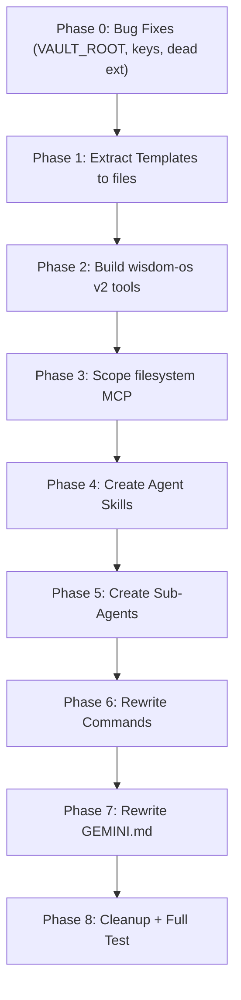

# Kybernetes OS v2: Step-by-Step Execution Plan

Implementation plan for rebuilding the Kybernetes OS backend using the merged C+D architecture (Hybrid Kernel + Sub-Agent Swarm). Each phase is an atomic improvement -- the system remains fully functional after every phase.

> [!IMPORTANT]
> **Ordering principle:** Dependencies flow downward. We build bottom-up: fix the foundation (Layer 4 tools), then build the orchestration layers (Skills, Agents, Commands), then slim the kernel (GEMINI.md) last. This way, nothing breaks mid-migration because the old system is only retired after the new system is proven.

---

## Phase 0: Critical Bug Fixes (Zero-Risk Hotfixes)

**Goal:** Fix showstopper bugs that exist independently of the v2 migration. After this phase, the current v1 system works better than before.

### Step 0.1: Fix `VAULT_ROOT` in `tools.py`

**File:** [tools.py](file:///d:/WISDOM/Kybernetes/90_System/Scripts/tools.py)

**Change:** Line 24: `Path(r"D:\WISDOM\WISDOM")` -> `Path(r"D:\WISDOM\Kybernetes")`

**Verification:** After the fix, run `gemini` in `D:\WISDOM\Kybernetes`, type "list files in 00_Inbox using wisdom-os", and confirm files are returned (previously this would fail silently or return nothing).

**Risk:** None. This is a typo fix. No behavior changes for correct paths.

### Step 0.2: Move API Keys to Environment Variables

**File:** [settings.json](file:///C:/Users/ibtas/.gemini/settings.json)

**Changes:**
1. Replace the plaintext GitHub PAT with `${GITHUB_PAT}` (or the env var reference syntax supported by settings.json)
2. Replace the plaintext Brave API key with `${BRAVE_API_KEY}`
3. Set both as Windows environment variables via `setx` or System Properties

**Verification:** Run `gemini`, type "search for 'test' using brave-search." If Brave returns results, the env var is working. Run "list my GitHub repos" to verify GitHub PAT.

**Risk:** Low. If env vars aren't set, the servers fail to start (but they fail loudly, not silently).

### Step 0.3: Delete Dead Extension

**Target:** Delete `C:\Users\ibtas\.gemini\extensions\youtube-to-docs\` (entire directory)

**Verification:** Run `gemini`. Confirm no errors about youtube-to-docs on startup. Session should be identical.

**Risk:** None. Extension has no manifest; it's inert.

---

## Phase 1: Extract Templates from `GEMINI.md`

**Goal:** Move the 6 expansion templates (A-F) from inline GEMINI.md to standalone files. GEMINI.md still references them by path, so the old Inbox Processing logic still works. This is a pure extraction -- no behavioral change.

### Step 1.1: Create Template Files

**Directory:** `D:\WISDOM\Kybernetes\90_System\Templates\`

Create 6 new files by copying content from GEMINI.md:

| File | Source (GEMINI.md lines) | Content |
| :--- | :--- | :--- |
| `Template_A_DeepDive.md` | ~L131-149 | Template A header + sections |
| `Template_B_Arena.md` | ~L153-174 | Template B header + sections |
| `Template_C_RosettaStone.md` | ~L178-201 | Template C header + sections |
| `Template_D_Chronograph.md` | ~L205-220 | Template D header + sections |
| `Template_E_Algorithmist.md` | ~L224-246 | Template E header + sections |
| `Template_F_Debugger.md` | ~L250-265 | Template F header + sections |

Each template file should be self-contained (include headers, sections, formatting instructions) but NOT include the template selection logic (that moves to the `prompt-expand` skill later).

**Verification:** Open each file in Obsidian. Confirm it renders correctly. Confirm GEMINI.md still has the inline templates too (we remove them later in Phase 7).

**Risk:** None. These are new files added alongside the existing system.

---

## Phase 2: Build wisdom-os v2 Tools (Additive)

**Goal:** Add 7 new MCP tools to `tools.py`. All existing tools remain unchanged. The new tools are independent additions -- calling them is optional, and the old system continues to work without them.

**File:** [tools.py](file:///d:/WISDOM/Kybernetes/90_System/Scripts/tools.py) (we work on a copy: `tools_v2.py`, then swap at the end)

### Step 2.0: Create `tools_v2.py` as a Copy

Copy `tools.py` to `tools_v2.py` in the same directory. Apply all Phase 0 fixes (VAULT_ROOT, bare except, variable shadowing) to the copy. All subsequent steps modify `tools_v2.py`.

**Verification:** Run `python tools_v2.py` manually. Confirm it starts without errors and the MCP server initializes.

### Step 2.1: Add `scan_inbox` Tool

```python
# Scans 00_Inbox/ and returns structured JSON
# Input: none
# Output: [{filename, path, topics[], prompt_blocks[], needs_split}]
# Implementation:
#   - Walk 00_Inbox/*.md
#   - For each file, read content
#   - Extract {{...}} blocks via regex: r'\{\{(.+?)\}\}'
#   - Detect distinct H1/H2 headers as "topics"
#   - Set needs_split = True if len(topics) > 1
```

**Verification:** Create 2 test files in `00_Inbox/`:
- `test_simple.md`: "# Java Streams\nSome content"
- `test_prompt.md`: "# AI\n{{explain backpropagation}}\n# History\n{{causes of WW1}}"

Call `scan_inbox`. Expected output:
- `test_simple.md`: 1 topic, 0 prompts, needs_split=false
- `test_prompt.md`: 2 topics, 2 prompts, needs_split=true

Delete test files after.

### Step 2.2: Add `move_note` Tool

```python
# Moves a note within the vault. Updates source and destination T.O.C files.
# Input: source (relative path), destination (relative path -- folder)
# Output: "Moved {filename} to {destination}"
# Implementation:
#   - Validate both paths exist
#   - shutil.move(source, destination)
#   - Find T.O.C in destination's parent -> append [[filename]] link
#   - Find T.O.C in source's parent -> remove [[filename]] link if present
```

**Verification:** Create `00_Inbox/test_move.md` with some content. Call `move_note("00_Inbox/test_move.md", "20_CS_Core")`. Confirm:
1. File exists at `20_CS_Core/test_move.md`
2. `T.O.C (20_CS_Core).md` now contains `[[test_move]]`
3. File no longer exists in `00_Inbox/`

Clean up after.

### Step 2.3: Add `split_note` Tool

```python
# Splits a multi-topic note into separate files in 00_Inbox/.
# Input: path (relative), sections [{title, content_start, content_end}]
# Output: "Split into N files: [filenames]"
# Implementation:
#   - Read file content
#   - For each section, extract the content between markers
#   - Write to 00_Inbox/{sanitized_title}.md
#   - Delete or archive the original file
```

**Verification:** Create `00_Inbox/test_multi.md`:
```markdown
# Java Streams
Content about streams
# Ancient Rome
Content about Rome
```
Call `split_note` with appropriate section markers. Confirm two new files appear in `00_Inbox/`.

### Step 2.4: Add `ensure_toc_link` Tool

```python
# Ensures a note has a [[T.O.C (Parent)|Up to Parent]] wikilink at the top.
# Input: path (relative path to the note)
# Output: "T.O.C link ensured for {filename} -> {parent_toc}"
# Implementation:
#   - Determine parent directory
#   - Find the T.O.C file: "T.O.C ({folder_name}).md"
#   - Read the note's first 5 lines
#   - If no [[T.O.C line found, prepend it after any YAML frontmatter
#   - Also check the T.O.C file contains a link TO this note; add if missing
```

**Verification:** Create a note `20_CS_Core/test_orphan.md` without any T.O.C link. Call `ensure_toc_link("20_CS_Core/test_orphan.md")`. Confirm:
1. The note now has `[[T.O.C (20_CS_Core)|Up to 20_CS_Core]]` at the top
2. `T.O.C (20_CS_Core).md` contains `[[test_orphan]]`

### Step 2.5: Add `add_frontmatter` Tool

```python
# Adds/merges YAML frontmatter tags on a note.
# Input: path (relative), tags (array of strings)
# Output: "Frontmatter updated for {filename}"
# Implementation:
#   - Read file
#   - If starts with "---", parse existing YAML block, merge new tags
#   - If no frontmatter, prepend new "---\ntags:\n  - ...\n---\n"
#   - Write back
```

**Verification:** Create `00_Inbox/test_fm.md` with no frontmatter. Call `add_frontmatter("00_Inbox/test_fm.md", ["#field/cs", "#subject/os"])`. Confirm the file now starts with proper YAML.

Call again with `["#concept/virtual-memory"]`. Confirm tags are merged, not duplicated.

### Step 2.6: Add `load_template` Tool

```python
# Returns the content of an expansion template by letter.
# Input: letter (string: A-F)
# Output: Full template content as text
# Implementation:
#   - Map letter to filename: Template_{A-F}_{name}.md
#   - Read from 90_System/Templates/
#   - Return content
```

**Verification:** Call `load_template("A")`. Confirm it returns the content of `Template_A_DeepDive.md`.

### Step 2.7: Add `expand_block` Tool

```python
# Expands a {{...}} prompt using a template. Writes result to output path.
# Input: prompt (string), template_letter (A-F), output_path (relative)
# Output: "Expansion written to {output_path}"
# Implementation Options (in priority order):
#   1. Primary: Use google-genai SDK to call Gemini API with a clean prompt
#      containing only the template + the user's prompt text
#   2. Fallback: If SDK unavailable, write a stub file with the template
#      structure pre-filled and the prompt embedded, for manual completion
```

> [!WARNING]
> This tool has an external dependency (`google-genai` SDK). If this adds too much complexity, we can defer this tool and rely on the @expander sub-agent instead. The skill's Step 4 supports both paths.

**Verification:** Call `expand_block("explain virtual memory", "A", "00_Inbox/test_expansion.md")`. Confirm a file is created with the Deep Dive template structure.

### Step 2.8: Swap `tools.py` -> `tools_v2.py`

1. Rename `tools.py` to `tools_v1_backup.py`
2. Rename `tools_v2.py` to `tools.py`
3. Update `settings.json` if the MCP command references the filename explicitly

**Verification:** Start `gemini`. Run "list files in 00_Inbox using wisdom-os" (tests old tool). Run "scan the inbox using wisdom-os" (tests new tool). Both should work.

**Rollback:** If anything breaks, swap the files back. The backup is right there.

---

## Phase 3: Scope `filesystem` MCP Server

**Goal:** Remove `D:\WISDOM` from the `filesystem` server's allowed directories. After this, the LLM can ONLY access the vault through `wisdom-os`.

**File:** [settings.json](file:///C:/Users/ibtas/.gemini/settings.json)

### Step 3.1: Edit `filesystem` Args

Remove `D:\WISDOM\Kybernetes` from the args array. Keep:
```json
"args": ["-y", "@modelcontextprotocol/server-filesystem",
  "D:\\PROJECTS", "D:\\Languages", "D:\\University", "D:\\Inbox", "D:\\Media"]
```

**Verification:** Start `gemini`. Ask: "Read the file 20_CS_Core/Languages/Python.md using filesystem." This should FAIL (access denied). Then ask: "Read the file 20_CS_Core/Languages/Python.md using wisdom-os." This should SUCCEED.

**Risk:** If the LLM defaults to `filesystem` for vault ops out of habit, it will get errors. But those errors are informative ("access denied") and will push the LLM to use `wisdom-os`. This is the intended behavior.

---

## Phase 4: Create Agent Skills

**Goal:** Create the 6 skill directories with their `SKILL.md` files. These are purely additive -- the old commands still work. Skills become available for discovery but don't interfere until commands are rewritten in Phase 6.

**Directory:** `C:\Users\ibtas\.gemini\skills\` (create if it doesn't exist)

### Step 4.1: Create `inbox-sort` Skill

**Path:** `.gemini/skills/inbox-sort/SKILL.md`

Content as specified in Section 4.2 of the System Specification: 6-step workflow (Scan, Classify, Split, Expand, Move & Link, Report). Include the Surgeon Rule constraint.

**Also create:**
- `.gemini/skills/inbox-sort/references/routing_rules.md` -- the classification rules for file routing
- `.gemini/skills/inbox-sort/scripts/expand_block.py` -- standalone Python script for template expansion (fallback for @expander)

### Step 4.2: Create `prompt-expand` Skill

**Path:** `.gemini/skills/prompt-expand/SKILL.md`

Content: Template selection logic (the IF/ELSE chain from GEMINI.md L120-127) + expansion rules (300-500 words, Seed Rule).

**Also create:**
- `.gemini/skills/prompt-expand/references/template_selection_guide.md`

### Step 4.3: Create `daily-boot` Skill

**Path:** `.gemini/skills/daily-boot/SKILL.md`

Content: 4-phase workflow (Gather Intelligence, Synthesize, Generate, Report). References timetable and deadline files.

**Also create:**
- `.gemini/skills/daily-boot/references/daily_template.md` -- the Daily Note structure

### Step 4.4: Create `project-init` Skill

**Path:** `.gemini/skills/project-init/SKILL.md`

Content: 3-step workflow (Physical Build, Logical Link, Memory Sync).

### Step 4.5: Create `drive-sync` Skill

**Path:** `.gemini/skills/drive-sync/SKILL.md`

Content: 3-step workflow (Scan D:\ directories, Reconcile with Memory, Report diff).

### Step 4.6: Create `web-ingest` Skill

**Path:** `.gemini/skills/web-ingest/SKILL.md`

Content: 4-step workflow (Acquire via Puppeteer, Process content, Save as note, Report).

### Verification (All Skills)

Start `gemini`. Type: "What skills do you have available?" The LLM should list the 6 skills by name + description. This confirms auto-discovery is working.

Then test one manually: Type "I want to sort my inbox, please use the inbox-sort skill." Confirm the LLM loads the SKILL.md and follows the step-by-step workflow. **This is a smoke test -- the skill should work even before commands are rewritten.**

---

## Phase 5: Create Sub-Agents

**Goal:** Create the @expander and @librarian agent definitions. These are optional specialist units dispatched by skills.

**Directory:** `C:\Users\ibtas\.gemini\agents\` (create if it doesn't exist)

### Step 5.1: Create `@expander` Agent

**Path:** `.gemini/agents/expander/AGENT.md`

Content as specified in Section 5.1 of the System Specification:
- Single-purpose: expand a prompt block using a given template
- Explicit rule: "Do NOT call sequential-thinking"
- Explicit rule: "Do NOT process any other GEMINI.md instructions"

### Step 5.2: Create `@librarian` Agent

**Path:** `.gemini/agents/librarian/AGENT.md`

Content as specified:
- Single-purpose: ensure T.O.C links, add frontmatter, verify graph connectivity
- Explicit rule: "Do NOT modify note content beyond frontmatter and T.O.C link"

### Verification

Start `gemini`. Ask: "Delegate to the expander agent to expand this prompt: {{explain virtual memory}} using Template A." Confirm the @expander activates, generates output, and writes to a file.

Ask: "Delegate to the librarian agent to ensure T.O.C links for 20_CS_Core/test_orphan.md." Confirm @librarian calls the `ensure_toc_link` tool.

> [!NOTE]
> Sub-agents are experimental. If they don't activate reliably, that's fine -- every skill has a fallback path that uses tools directly. Document any failures here for future reference.

---

## Phase 6: Rewrite Custom Commands

**Goal:** Replace the inline-logic commands with 3-line skill triggers. After this phase, every command deterministically invokes its corresponding skill.

**Directory:** `C:\Users\ibtas\.gemini\commands\`

### Step 6.1: Rewrite `/os:sort`

**File:** `commands/os/sort.toml`

Replace the entire prompt with:
```toml
description = "Sorts and processes the Obsidian and Physical Inboxes."
prompt = """You MUST use the 'inbox-sort' skill to process this request.
Load and follow the instructions in the inbox-sort SKILL.md exactly.
Target directories:
- Physical: D:\Inbox (via filesystem)
- Logical: D:\WISDOM\Kybernetes\00_Inbox (via wisdom-os)"""
```

### Step 6.2: Rewrite `/os:boot`

Replace with daily-boot skill trigger. Remove all phantom tool references (`gmail-custom`, `calendar-personal`).

### Step 6.3: Rewrite `/os:sync`

Replace with drive-sync skill trigger.

### Step 6.4: Rewrite `/dev:new`

Replace with project-init skill trigger. Pass `{{args}}` as the project name.

### Step 6.5: Rewrite `/web:eat`

Replace with web-ingest skill trigger. Pass `{{args}}` as the URL.

### Step 6.6: Delete `/os:spawn`

Delete `commands/os/spawn.toml` (if it exists). The shell-pipe spawning pattern is replaced by @expander sub-agent + `expand_block` tool.

### Verification

Test each command in a fresh `gemini` session:

| Command | Expected Behavior |
| :--- | :--- |
| `/os:sort` | LLM loads inbox-sort SKILL.md, calls `scan_inbox`, follows steps |
| `/os:boot` | LLM loads daily-boot SKILL.md, reads timetable/deadlines, generates daily note |
| `/dev:new TestProject` | LLM loads project-init SKILL.md, scaffolds `D:\PROJECTS\TestProject` |
| `/web:eat https://example.com` | LLM loads web-ingest SKILL.md, uses puppeteer, saves note |
| `/os:sync` | LLM loads drive-sync SKILL.md, scans D:\, reconciles memory |

---

## Phase 7: Rewrite `GEMINI.md` (The Slim Kernel)

**Goal:** Strip GEMINI.md from ~388 lines (~4,600 tokens) to ~100 lines (~1,500 tokens). This is the LAST phase because all the extracted content now lives in skills, templates, and tools.

**File:** [GEMINI.md](file:///d:/WISDOM/Kybernetes/GEMINI.md)

### Step 7.1: Draft the New GEMINI.md

Structure (using the corrections from user feedback):

1. **Vault Overview** (keep lines 1-6 unchanged)
2. **Graph Architecture** (keep lines 8-34 unchanged -- T.O.C backbone, tagging, graph aesthetics)
3. **Kernel Identity** (keep lines 36-49 -- identity + bridge protocol, with tool scoping added: "Use wisdom-os for vault, filesystem for D:\ physical")
4. **Drive Architecture** (keep lines 53-83 -- partition map)
5. **Directory Routing** (keep lines 282-329 -- folder descriptions)
6. **Personas** (keep Chief Engineer + Navigator mandates VERBATIM, remove framing/triggers/headers -- ~200 tokens instead of ~350)
7. **Workflow Dispatch** (NEW, 2 lines: "All structured workflows are triggered via custom commands. Follow the named skill's SKILL.md exactly.")
8. **Conventions** (keep lines 384-388 unchanged)
9. **Memory Protocol** (compressed to 3 lines)

### Step 7.2: Remove Extracted Content

Delete from GEMINI.md (now safely lives elsewhere):
- Inbox Processing Protocol (L89-118) -> lives in `inbox-sort` skill
- Template Selection Logic (L120-127) -> lives in `prompt-expand` skill
- Templates A-F (L129-265) -> live in `90_System/Templates/`
- Surgeon Rule (L267-270) -> lives in `inbox-sort` skill constraints
- Mental Model catalog (L356-382) -> files remain in `90_System/Agents/Gemini/`
- Persona framing text (L330-333) -> removed; mandates kept

### Verification

Start `gemini`. Run through these scenarios:

1. **General Q&A:** Ask "Explain virtual memory in C++ terms." Confirm the Chief Engineer persona mandates still apply (internals, analogies, no preamble).
2. **Navigation:** Ask "Explain the causes of WW1." Confirm the Navigator persona mandates still apply (first principles, systemic context).
3. **Inbox Processing:** Run `/os:sort`. Confirm it still works (skill provides the workflow, not GEMINI.md).
4. **Context size:** The LLM's initial system message should be noticeably shorter. Check by asking "How long is your system prompt?" (rough heuristic).

---

## Phase 8: Cleanup and Validation

### Step 8.1: Remove `tools_v1_backup.py`

Once Phase 7 is verified, delete `90_System/Scripts/tools_v1_backup.py`.

### Step 8.2: Update T.O.C Files

Ensure `T.O.C (Templates).md` includes links to the 6 new template files.

### Step 8.3: Full System Smoke Test

Run through ALL commands + general usage in a single session:

| Test | Pass Criteria |
| :--- | :--- |
| `/os:sort` with a test file in Inbox | File classified, moved, T.O.C linked, frontmatter added |
| `/os:sort` with a `{{...}}` block | Block expanded using correct template, result saved |
| `/os:boot` | Daily note created with schedule + priorities |
| `/dev:new SmokeTest` | Project scaffolded at `D:\PROJECTS\SmokeTest`, note in `40_Projects` |
| `/web:eat` with a test URL | Page scraped, note saved in `00_Inbox` |
| General CS question | Chief Engineer persona active (no preamble, internals-first) |
| General knowledge question | Navigator persona active (root causes, systemic framing) |
| "Read a file in D:\WISDOM using filesystem" | Should FAIL (scoped out) |
| "Read a file in 20_CS_Core using wisdom-os" | Should SUCCEED |

---

## Execution Order Summary



**Each phase is a safe stopping point.** You can complete Phase 0-3 today, and the system works better than before. Phases 4-7 can be done incrementally over days.

## Verification Plan

Since there is no existing test infrastructure for this project, all verification is manual through interactive `gemini` sessions inside `D:\WISDOM\Kybernetes`. Each phase above includes inline verification steps. The Phase 8 smoke test is the final end-to-end validation covering all commands and both personas.

> [!IMPORTANT]
> **User involvement needed for verification:** Since skills and sub-agents run inside the Gemini CLI (not this Antigravity session), all testing must happen in a separate Gemini CLI terminal invoked by the user. I will prepare the files; you run the tests in your own `gemini` session.
